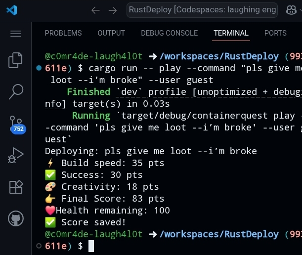
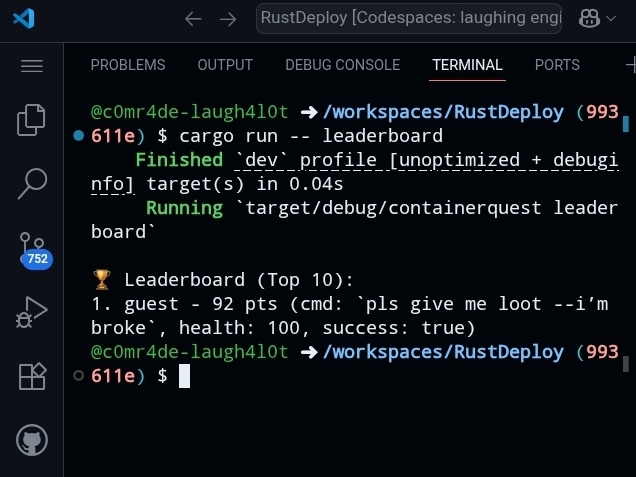
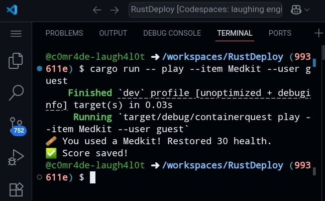

# 🐳 ContainerQuest

**ContainerQuest** is a Reddit + Terminal mini-game where users “deploy” or “open” virtual containers, collect loot, survive traps, and climb the leaderboard.  

This project was built for the **Reddit Hackathon**.  

---

##  Screenshots

- 
- 
- 

---

##  How to Play

###  Clone the repo
```bash
git clone https://github.com/yourusername/containerquest.git
cd containerquest
```
## Run the game
```bash
cargo run -- play --command "build fast --optimize" --user guest
cargo run -- play --command "pls give me loot --i’m broke" --user guest
cargo run -- play --item Medkit --user guest
cargo run -- leaderboard
```

---

##  Features

Deploy commands to simulate container builds

Collect loot and creativity points

Survive traps and failures that reduce health

Use healing items (Medkit, Potion, Bandage)

Streak bonuses for daily play

Leaderboard to compete with others


---

##  Build
```bash
cargo build
```

---

##  Example Commands
```bash
cargo run -- play --command "build fast --optimize" --user guest
cargo run -- play --command "pls give me loot --i’m broke" --user guest
cargo run -- play --item Medkit --user guest
cargo run -- leaderboard
```


